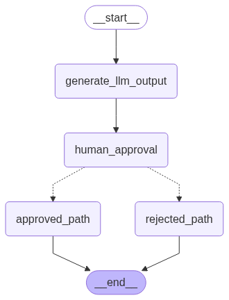

## **Human Approval — Approve / Reject**

> Ref. https://langchain-ai.github.io/langgraph/how-tos/human_in_the_loop/add-human-in-the-loop/#approve-or-reject



Pause the graph before a critical step, such as an API call, to review and approve the action. If the action is rejected, ***you can prevent the graph from executing the step, and potentially take an alternative action***. This pattern often involves routing the graph based on the human's input.

### **Usage**

Assume LLM generated `AIMessage`, in this example you can sending any `HumanMessage`:

```sh
curl --location 'http://localhost:8000/chat/1' \
--header 'Content-Type: application/json' \
--data '{
    "message": ""
}'
```

> ---
> **NOTE**: In this case `AIMessage` from previous node is in `state["llm_output"]`. Next then approval node should look like this:
>
> ```py
> def node(self, state:State, config:RunnableConfig) -> Command[Literal["approved_path", "rejected_path"]]:
>   print("--------- HumanApprovalNode ---------")
>   pprint(state)  
>  
>   human = interru  pt({
>       "question":   "Do you approve the following output?",
>       "llm_output  ": state["llm_output"].content,
>       "run_id": config.get('configurable').get('run_id')
>   })
>
>   decision = human.get("interrupt_response")
>   state["messages"].append(HumanMessage(content=f"Human approval: {decision}"))
>  
>   if decision == "approve":
>       return Command(goto="approved_path", update={"decision":"approved"})
>   else:
>       return Command(goto="rejected_path", update={"decision":"rejected"})
>  
> ```

The `interrupt()` function, pause the flow to get feedback from user, ex. output:

```sh
data: This is the generated output.

data: {'question': 'Do you approve the following output?', 'llm_output': 'This is the generated output.', 'run_id': '76842d88-75ca-4b8a-892e-cbb1a7a942f0'}
```

This time client saw question from AI with `run_id` (or any ID bbased on your setup), your feedback message must attached `run_id` into payload to resume the flow:

```sh
curl --location 'http://localhost:8000/chat/1' \
--header 'Content-Type: application/json' \
--data '{
    "run_id": "76842d88-75ca-4b8a-892e-cbb1a7a942f0",
    "message": "approve"
}'
```

After user feedback with `run_id`, it will resume to the flow at this code statment:

```py
human = interrupt({ ... })
  ^
  |___ here

decision = human.get("interrupt_response")
```

Ex. output result at final node:

```sh
data: Human approval: approve
```

### **Information**

Resume function requires:

- `run_id` or any name that you set.
- `interrupt_response` this attribute same result as :

    ```py
    state['messages'].append(LATEST_MSG_FROM_USER).
    ```

- `question` or any attribute name thhat you want to receive feedback from user.
- `astream` or `stream` of graph object should provides 2-modes, ex:

    ```py
    # >>> manage graph's config and threads <<<
    async for chunk in graph.astream(
        user_input,
        config,
        stream_mode=["messages", "updates"]
    ):
        mode, data = chunk

        if mode == "messages":
            message_chunk, metadata = data

            # >>> process the chunk messages <<<

            yield send_message(message)
            await asyncio.sleep(0.01)

        elif mode == "updates":
            interrupt = data.get("__interrupt__")
            if interrupt:
                interrupt, = interrupt

                # >>> process the interrupt <<<

                yield send_message(interrupt.value)
                await asyncio.sleep(0.01)
    ```

    Ex. stream frunction should look like this:

    ```py
    def send_message(message: str):
        return f"data: {message}\n\n"
        
    async def stream_graph_updates(thread_id: str, request: ChatRequest):

        config = {
            'configurable': {
                'thread_id': thread_id,
                'run_id': str(uuid.uuid4())
            }
        }

        graph = graph_cache[thread_id].get("graph")
        snapshot = graph.get_state(config)
        snapshot.next
        
        if request.run_id:
            user_input = Command(
                resume={
                    "interrupt_response": request.message,
                    "question": "Do you approve the following output?",
                    "run_id": request.run_id
                }
            )
        else:
            user_input = {"messages": [HumanMessage(content=request.message)]}

        # reduce workload when streaming
        buffer = []
        
        async for chunk in graph.astream(
            user_input,
            config,
            stream_mode=["messages", "updates"]
        ):

            mode, data = chunk

            if mode == "messages":
                message_chunk, metadata = data
                content = message_chunk.content if hasattr(message_chunk, "content") else message_chunk
                print(content, end="|", flush=True)
                buffer.append(transform_message(content))
                
                if len(buffer) >= STREAM_TOKEN_BUFFER_SIZE:
                    message = "".join(buffer).strip()
                    buffer.clear()
                    yield send_message(message)
                    await asyncio.sleep(0.01)
            elif mode == "updates":
                pprint(data)

                interrupt = data.get("__interrupt__")
                if interrupt:
                    interrupt, = interrupt
                    if len(buffer) > 0:
                        message = "".join(buffer).strip()
                        buffer.clear()
                        yield send_message(message)
                        await asyncio.sleep(0.01)

                    yield send_message(interrupt.value)
                    await asyncio.sleep(0.01)

        if len(buffer) > 0:
            message = "".join(buffer).strip()
            buffer.clear()
            yield send_message(message)
            await asyncio.sleep(0.01)
    ```

#### Example output log

```sh
learn_langchain_langgraph  | StateSnapshot(values={}, next=(), config={'configurable': {'thread_id': '1', 'run_id': 'ffb50095-2f9f-48e2-9e99-2b78a9ae8092'}}, metadata=None, created_at=None, parent_config=None, tasks=(), interrupts=())
learn_langchain_langgraph  | --------- GenerateNode ---------
learn_langchain_langgraph  | ================================== Ai Message ==================================
learn_langchain_langgraph  |
learn_langchain_langgraph  | This is the generated output.
learn_langchain_langgraph  | <class 'tuple'>
learn_langchain_langgraph  | ('messages',
learn_langchain_langgraph  |  (HumanMessage(content='', additional_kwargs={}, response_metadata={}, id='24212b56-61c8-4499-8bbd-71466c3f5e6a'),
learn_langchain_langgraph  |   {'langgraph_checkpoint_ns': 'generate_llm_output:c213275e-9816-6c16-0e34-056bf85a532b',
learn_langchain_langgraph  |    'langgraph_node': 'generate_llm_output',
learn_langchain_langgraph  |    'langgraph_path': ('__pregel_pull', 'generate_llm_output'),
learn_langchain_langgraph  |    'langgraph_step': 1,
learn_langchain_langgraph  |    'langgraph_triggers': ('branch:to:generate_llm_output',),
learn_langchain_langgraph  |    'run_id': 'ffb50095-2f9f-48e2-9e99-2b78a9ae8092',
learn_langchain_langgraph  |    'thread_id': '1'}))
learn_langchain_langgraph  | |<class 'tuple'>
learn_langchain_langgraph  | ('messages',
learn_langchain_langgraph  |  (AIMessage(content='This is the generated output.', additional_kwargs={}, response_metadata={}, id='ab2c48db-8b63-42f3-ada6-d87cc5028c6b'),
learn_langchain_langgraph  |   {'langgraph_checkpoint_ns': 'generate_llm_output:c213275e-9816-6c16-0e34-056bf85a532b',
learn_langchain_langgraph  |    'langgraph_node': 'generate_llm_output',
learn_langchain_langgraph  |    'langgraph_path': ('__pregel_pull', 'generate_llm_output'),
learn_langchain_langgraph  |    'langgraph_step': 1,
learn_langchain_langgraph  |    'langgraph_triggers': ('branch:to:generate_llm_output',),
learn_langchain_langgraph  |    'run_id': 'ffb50095-2f9f-48e2-9e99-2b78a9ae8092',
learn_langchain_langgraph  |    'thread_id': '1'}))
learn_langchain_langgraph  | This is the generated output.|<class 'tuple'>
learn_langchain_langgraph  | ('updates',
learn_langchain_langgraph  |  {'generate_llm_output': {'llm_output': AIMessage(content='This is the generated output.', additional_kwargs={}, response_metadata={}, id='ab2c48db-8b63-42f3-ada6-d87cc5028c6b'),
learn_langchain_langgraph  |                           'messages': [HumanMessage(content='', additional_kwargs={}, response_metadata={}, id='24212b56-61c8-4499-8bbd-71466c3f5e6a'),
learn_langchain_langgraph  |                                        AIMessage(content='This is the generated output.', additional_kwargs={}, response_metadata={}, id='ab2c48db-8b63-42f3-ada6-d87cc5028c6b')]}})
learn_langchain_langgraph  | {'generate_llm_output': {'llm_output': AIMessage(content='This is the generated output.', additional_kwargs={}, response_metadata={}, id='ab2c48db-8b63-42f3-ada6-d87cc5028c6b'),
learn_langchain_langgraph  |                          'messages': [HumanMessage(content='', additional_kwargs={}, response_metadata={}, id='24212b56-61c8-4499-8bbd-71466c3f5e6a'),
learn_langchain_langgraph  |                                       AIMessage(content='This is the generated output.', additional_kwargs={}, response_metadata={}, id='ab2c48db-8b63-42f3-ada6-d87cc5028c6b')]}}
learn_langchain_langgraph  | --------- HumanApprovalNode ---------
learn_langchain_langgraph  | {'llm_output': AIMessage(content='This is the generated output.', additional_kwargs={}, response_metadata={}, id='ab2c48db-8b63-42f3-ada6-d87cc5028c6b'),
learn_langchain_langgraph  |  'messages': [HumanMessage(content='', additional_kwargs={}, response_metadata={}, id='24212b56-61c8-4499-8bbd-71466c3f5e6a'),
learn_langchain_langgraph  |               AIMessage(content='This is the generated output.', additional_kwargs={}, response_metadata={}, id='ab2c48db-8b63-42f3-ada6-d87cc5028c6b')]}
learn_langchain_langgraph  | <class 'tuple'>
learn_langchain_langgraph  | ('updates',
learn_langchain_langgraph  |  {'__interrupt__': (Interrupt(value={'llm_output': 'This is the generated '
learn_langchain_langgraph  |                                                    'output.',
learn_langchain_langgraph  |                                      'question': 'Do you approve the following '
learn_langchain_langgraph  |                                                  'output?',
learn_langchain_langgraph  |                                      'run_id': 'ffb50095-2f9f-48e2-9e99-2b78a9ae8092'},
learn_langchain_langgraph  |                               resumable=True,
learn_langchain_langgraph  |                               ns=['human_approval:04e00c38-3e17-6227-0c85-0fa2f8a69cd6']),)})
learn_langchain_langgraph  | {'__interrupt__': (Interrupt(value={'llm_output': 'This is the generated '
learn_langchain_langgraph  |                                                   'output.',
learn_langchain_langgraph  |                                     'question': 'Do you approve the following '
learn_langchain_langgraph  |                                                 'output?',
learn_langchain_langgraph  |                                     'run_id': 'ffb50095-2f9f-48e2-9e99-2b78a9ae8092'},
learn_langchain_langgraph  |                              resumable=True,
learn_langchain_langgraph  |                              ns=['human_approval:04e00c38-3e17-6227-0c85-0fa2f8a69cd6']),)}
learn_langchain_langgraph  | INFO:     172.18.0.1:58628 - "POST /chat/1 HTTP/1.1" 200 OK
learn_langchain_langgraph  | StateSnapshot(values={'messages': [HumanMessage(content='', additional_kwargs={}, response_metadata={}, id='24212b56-61c8-4499-8bbd-71466c3f5e6a'), AIMessage(content='This is the generated output.', additional_kwargs={}, response_metadata={}, id='ab2c48db-8b63-42f3-ada6-d87cc5028c6b')], 'llm_output': AIMessage(content='This is the generated output.', additional_kwargs={}, response_metadata={}, id='ab2c48db-8b63-42f3-ada6-d87cc5028c6b')}, next=('human_approval',), config={'configurable': {'thread_id': '1', 'checkpoint_ns': '', 'checkpoint_id': '1f0575e8-c1e4-60ee-8001-9647589dbb90'}}, metadata={'source': 'loop', 'writes': {'generate_llm_output': {'messages': [HumanMessage(content='', additional_kwargs={}, response_metadata={}, id='24212b56-61c8-4499-8bbd-71466c3f5e6a'), AIMessage(content='This is the generated output.', additional_kwargs={}, response_metadata={}, id='ab2c48db-8b63-42f3-ada6-d87cc5028c6b')], 'llm_output': AIMessage(content='This is the generated output.', additional_kwargs={}, response_metadata={}, id='ab2c48db-8b63-42f3-ada6-d87cc5028c6b')}}, 'step': 1, 'parents': {}, 'thread_id': '1', 'run_id': 'ffb50095-2f9f-48e2-9e99-2b78a9ae8092'}, created_at='YYYY-MM-DDT16:06:43.782050+00:00', parent_config={'configurable': {'thread_id': '1', 'checkpoint_ns': '', 'checkpoint_id': '1f0575e8-c1dd-640b-8000-9bf3e86af5f6'}}, tasks=(PregelTask(id='04e00c38-3e17-6227-0c85-0fa2f8a69cd6', name='human_approval', path=('__pregel_pull', 'human_approval'), error=None, interrupts=(Interrupt(value={'question': 'Do you approve the following output?', 'llm_output': 'This is the generated output.', 'run_id': 'ffb50095-2f9f-48e2-9e99-2b78a9ae8092'}, resumable=True, ns=['human_approval:04e00c38-3e17-6227-0c85-0fa2f8a69cd6']),), state=None, result=None),), interrupts=(Interrupt(value={'question': 'Do you approve the following output?', 'llm_output': 'This is the generated output.', 'run_id': 'ffb50095-2f9f-48e2-9e99-2b78a9ae8092'}, resumable=True, ns=['human_approval:04e00c38-3e17-6227-0c85-0fa2f8a69cd6']),))
learn_langchain_langgraph  | '\n\n------------- Resume -------------\n'
learn_langchain_langgraph  | Command(resume={'interrupt_response': 'approve', 'question': 'Do you approve the following output?', 'run_id': 'ffb50095-2f9f-48e2-9e99-2b78a9ae8092'})
learn_langchain_langgraph  | '\n\n'
learn_langchain_langgraph  | --------- HumanApprovalNode ---------
learn_langchain_langgraph  | {'llm_output': AIMessage(content='This is the generated output.', additional_kwargs={}, response_metadata={}, id='ab2c48db-8b63-42f3-ada6-d87cc5028c6b'),
learn_langchain_langgraph  |  'messages': [HumanMessage(content='', additional_kwargs={}, response_metadata={}, id='24212b56-61c8-4499-8bbd-71466c3f5e6a'),
learn_langchain_langgraph  |               AIMessage(content='This is the generated output.', additional_kwargs={}, response_metadata={}, id='ab2c48db-8b63-42f3-ada6-d87cc5028c6b')]}
learn_langchain_langgraph  | <class 'tuple'>
learn_langchain_langgraph  | ('updates', {'human_approval': {'decision': 'approved'}})
learn_langchain_langgraph  | {'human_approval': {'decision': 'approved'}}
learn_langchain_langgraph  | --------- ApprovedNode ---------
learn_langchain_langgraph  | <class 'tuple'>
learn_langchain_langgraph  | ('messages',
learn_langchain_langgraph  |  (HumanMessage(content='Human approval: approve', additional_kwargs={}, response_metadata={}, id='f11d4d2d-a4f3-42e3-904d-271db9e324eb'),
learn_langchain_langgraph  |   {'langgraph_checkpoint_ns': 'approved_path:34de217e-b20e-a717-c00e-d8da9c8ce20d',
learn_langchain_langgraph  |    'langgraph_node': 'approved_path',
learn_langchain_langgraph  |    'langgraph_path': ('__pregel_pull', 'approved_path'),
learn_langchain_langgraph  |    'langgraph_step': 3,
learn_langchain_langgraph  |    'langgraph_triggers': ('branch:to:approved_path',),
learn_langchain_langgraph  |    'run_id': 'aac43cd8-09b1-4c3b-a243-2e8ecdad6451',
learn_langchain_langgraph  |    'thread_id': '1'}))
```
