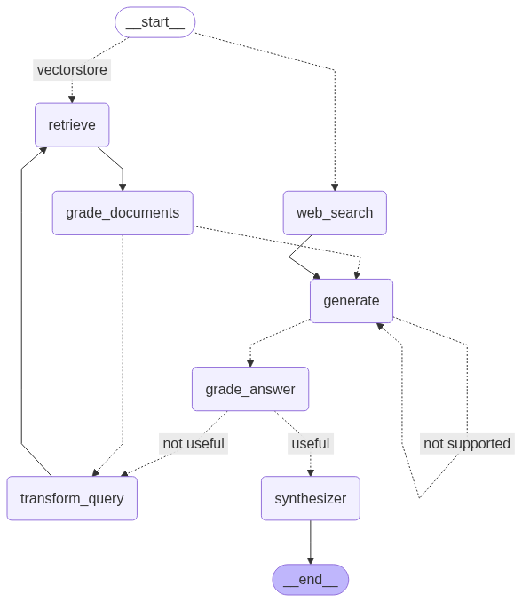

## Adaptive RAG

> Ref. https://langchain-ai.github.io/langgraph/tutorials/rag/langgraph_adaptive_rag/?h=ad#llms



Flow:

- If user's question is related data in vectordb:
  - yes: `retrieve`
  - no: `web_search`
- `web_search` - finding data via tool name `Taviry`.
- `generate` - use the searching data to be context of our prompt in LLM (context, question, answer).
- `grade_answer` - validate generated answer from `generate`.
- `synthesizer` - summarize data if the answer useful.
- `transform_query` - transform question if not useful.

### Prerequisites

- Chroma
- Ollama
- Environment variables:

    ```txt
    USER_AGENT=learn_langchain_langgraph/0.1

    # For download embedding model from huggingface
    HF_TOKEN=hf_hD...TcDM

    # To support retriever selection in the future
    RETRIEVER_PROVIDER_NAME=chroma

    # Chroma settings
    CHROMA_HOST=chroma
    CHROMA_PORT=8000
    CHROMA_DEVICE=cpu
    ```

### Usage

Setting model/agent:

```sh
curl --location 'http://localhost:8000/chat/setting/1' \
--header 'Content-Type: application/json' \
--data '{
    "base_url": "http://local-ollama-service:11434",
    "model_name": "llama3.2:latest",
    "temperature": 0.7,
    "streaming": false,
    "use_agent": "adaptive_rag", 
    "save_graph_path": "./output/graph-adaptive-rag.png"
}'
```

Upload your documents (website's urls) that you want to vectordb (retriever), in this case it is ChromaDB:

```sh
curl --location 'http://localhost:8000/document/upload' \
--header 'Content-Type: application/json' \
--data '{
    "collection_name": "poc",
    "urls": [
        "https://lilianweng.github.io/posts/2023-06-23-agent/",
        "https://lilianweng.github.io/posts/2023-03-15-prompt-engineering/",
        "https://lilianweng.github.io/posts/2023-10-25-adv-attack-llm/"
    ]
}'
```

Let's chat:

```sh
curl --location 'http://localhost:8000/chat/1' \
--header 'Content-Type: application/json' \
--data '{
    "message": "Who will the Bears draft first in the NFL draft?"
}'
```

Ex. result:

```json
{
    "data": "The Chicago Bears will draft Colston Loveland, a tight end from the University of Michigan, with the No. 10 overall pick in the 2025 NFL Draft."
}
```

Ex. log:

```sh
learn_langchain_langgraph  | StateSnapshot(values={}, next=(), config={'configurable': {'thread_id': '1'}}, metadata=None, created_at=None, parent_config=None, tasks=(), interrupts=())
learn_langchain_langgraph  | ---ROUTE QUESTION---
learn_langchain_langgraph  | ---ROUTE QUESTION TO WEB SEARCH---
learn_langchain_langgraph  | result: web_search
learn_langchain_langgraph  |
learn_langchain_langgraph  | ---WEB SEARCH---
learn_langchain_langgraph  | {'documents': [Document(metadata={}, page_content="The big-ticket Chicago Bears NFL Draft picks will come from their first three selections, all of which are slated to be in the top 50. The Bears' first-round pick, No. 10 overall, is a true wildcard."),
learn_langchain_langgraph  |                Document(metadata={}, page_content="Chicago Bears Official Website | ChicagoBears.com\n\nBears Draft Report\n\nChicago Bears select TE Colston Loveland in first round of 2025 NFL Draft\n\nRELATED: Stay up-to-date with all the Chicago Bears 2025 NFL Draft picks by clicking here.\n\nThe Chicago Bears selected University of Michigan tight end Colston Loveland with the No. 10 overall pick in the 2025 NFL Draft. Loveland became just the third tight end selected by the Bears in the first round of an NFL Draft in the Common Draft Era [...] Bears second round picks receiver Luther Burden III (No. 39), offensive lineman Ozzy Trapilo (No. 56) and defensive lineman Shemar Turner (No. 62) met with the media at Halas for their introductory press conferences.\n\nChicago Bears select RB Kyle Monangai in seventh round of 2025 NFL Draft\n\nThe Chicago Bears selected Rutgers University running back Kyle Monangai with the No. 233 overall pick in the seventh round of the 2025 NFL Draft.\n\nLuke Newman elated to experience life-changing event [...] Recap the Bears' 2025 Draft with news, photos, highlights and more featuring the eight members of the club's newest rookie class.\n\nBears benefit from staying disciplined throughout draft\n\nSticking with their best-player-available approach in the draft enabled the Bears to add prospects who will improve depth and increase competition.\n\nSix things we learned from Bears second-round draft picks"),
learn_langchain_langgraph  |                Document(metadata={}, page_content="Chicago Bears general manager Ryan Poles and coach Ben Johnson remade their team's roster in the 2025 NFL Draft. The Bears entered the draft Thursday with seven picks, starting with the No. 10 overall selection in the first round, and intrigue about what player they would take quickly circulated."),
learn_langchain_langgraph  |                Document(metadata={}, page_content="The most impactful rookie from the Chicago Bears' 2025 draft class should be the first one GM Ryan Poles selected. Loveland is the kind of Swiss Army knife that can unlock Ben Johnson's offense, and with so much of the team's focus being centered on Caleb Williams breaking out this year, a player like Loveland -- arguably the most physically gifted pass-catching tight end the Bears have fielded in 20 years -- will go a long way in getting him there.\n\nMore Chicago Bears News: [...] 2. Ozzy Trapilo, OT, Boston College\n\nI debated putting Trapilo first on this list. He's going to start at offensive tackle, and it's trending like he'll replace Darnell Wright at right tackle and open the door for Wright to move to the left side. That's a big win for a Bears team that, if all goes well, will have a pair of quality bookend tackles for the foreseeable future. Trapilo is big, nasty, and smart. He'll quickly become a fan favorite.\n\n1. Colston Loveland, TE, Michigan [...] Chicago Bears' 2025 NFL Draft picks ranked by predicted impact this season\n\nBryan Perez | Apr 29, 2025\n\nThe Chicago Bears added eight new players to their roster after a successful 2025 NFL Draft, which featured three second-round picks and a unicorn playmaker at tight end.\n\nBut which Bears draft pick will make the biggest impact this season?\n\nLet's break it down, from eight to one.\n\n8. Luke Newman, OL, Michigan State"),
learn_langchain_langgraph  |                Document(metadata={}, page_content='Chicago Bears 2025 seven-round NFL Mock Draft First round, No. 10 overall The Pick: Will Campbell - OT, LSU In the last two drafts where the Bears had first-round picks, GM Ryan Poles has taken')],
learn_langchain_langgraph  |  'messages': [{'content': 'Who will the Bears draft first in the NFL draft?',
learn_langchain_langgraph  |                'role': 'user'}],
learn_langchain_langgraph  |  'question': 'Who will the Bears draft first in the NFL draft?'}
learn_langchain_langgraph  | ---GENERATE---
learn_langchain_langgraph  | {'documents': [Document(metadata={}, page_content="The big-ticket Chicago Bears NFL Draft picks will come from their first three selections, all of which are slated to be in the top 50. The Bears' first-round pick, No. 10 overall, is a true wildcard."),
learn_langchain_langgraph  |                Document(metadata={}, page_content="Chicago Bears Official Website | ChicagoBears.com\n\nBears Draft Report\n\nChicago Bears select TE Colston Loveland in first round of 2025 NFL Draft\n\nRELATED: Stay up-to-date with all the Chicago Bears 2025 NFL Draft picks by clicking here.\n\nThe Chicago Bears selected University of Michigan tight end Colston Loveland with the No. 10 overall pick in the 2025 NFL Draft. Loveland became just the third tight end selected by the Bears in the first round of an NFL Draft in the Common Draft Era [...] Bears second round picks receiver Luther Burden III (No. 39), offensive lineman Ozzy Trapilo (No. 56) and defensive lineman Shemar Turner (No. 62) met with the media at Halas for their introductory press conferences.\n\nChicago Bears select RB Kyle Monangai in seventh round of 2025 NFL Draft\n\nThe Chicago Bears selected Rutgers University running back Kyle Monangai with the No. 233 overall pick in the seventh round of the 2025 NFL Draft.\n\nLuke Newman elated to experience life-changing event [...] Recap the Bears' 2025 Draft with news, photos, highlights and more featuring the eight members of the club's newest rookie class.\n\nBears benefit from staying disciplined throughout draft\n\nSticking with their best-player-available approach in the draft enabled the Bears to add prospects who will improve depth and increase competition.\n\nSix things we learned from Bears second-round draft picks"),
learn_langchain_langgraph  |                Document(metadata={}, page_content="Chicago Bears general manager Ryan Poles and coach Ben Johnson remade their team's roster in the 2025 NFL Draft. The Bears entered the draft Thursday with seven picks, starting with the No. 10 overall selection in the first round, and intrigue about what player they would take quickly circulated."),
learn_langchain_langgraph  |                Document(metadata={}, page_content="The most impactful rookie from the Chicago Bears' 2025 draft class should be the first one GM Ryan Poles selected. Loveland is the kind of Swiss Army knife that can unlock Ben Johnson's offense, and with so much of the team's focus being centered on Caleb Williams breaking out this year, a player like Loveland -- arguably the most physically gifted pass-catching tight end the Bears have fielded in 20 years -- will go a long way in getting him there.\n\nMore Chicago Bears News: [...] 2. Ozzy Trapilo, OT, Boston College\n\nI debated putting Trapilo first on this list. He's going to start at offensive tackle, and it's trending like he'll replace Darnell Wright at right tackle and open the door for Wright to move to the left side. That's a big win for a Bears team that, if all goes well, will have a pair of quality bookend tackles for the foreseeable future. Trapilo is big, nasty, and smart. He'll quickly become a fan favorite.\n\n1. Colston Loveland, TE, Michigan [...] Chicago Bears' 2025 NFL Draft picks ranked by predicted impact this season\n\nBryan Perez | Apr 29, 2025\n\nThe Chicago Bears added eight new players to their roster after a successful 2025 NFL Draft, which featured three second-round picks and a unicorn playmaker at tight end.\n\nBut which Bears draft pick will make the biggest impact this season?\n\nLet's break it down, from eight to one.\n\n8. Luke Newman, OL, Michigan State"),
learn_langchain_langgraph  |                Document(metadata={}, page_content='Chicago Bears 2025 seven-round NFL Mock Draft First round, No. 10 overall The Pick: Will Campbell - OT, LSU In the last two drafts where the Bears had first-round picks, GM Ryan Poles has taken')],
learn_langchain_langgraph  |  'generation': AIMessage(content='The Chicago Bears will draft Colston Loveland, a tight end from the University of Michigan, with the No. 10 overall pick in the 2025 NFL Draft.', additional_kwargs={}, response_metadata={'model': 'llama3.2:latest', 'created_at': '...', 'done': True, 'done_reason': 'stop', 'total_duration': 505630490, 'load_duration': 54380918, 'prompt_eval_count': 955, 'prompt_eval_duration': 147233047, 'eval_count': 36, 'eval_duration': 299933335, 'model_name': 'llama3.2:latest'}, id='run--05269d2f-5f7c-431d-a1a8-74bbedc623fc-0', usage_metadata={'input_tokens': 955, 'output_tokens': 36, 'total_tokens': 991}),
learn_langchain_langgraph  |  'messages': [{'content': 'Who will the Bears draft first in the NFL draft?',
learn_langchain_langgraph  |                'role': 'user'}],
learn_langchain_langgraph  |  'question': 'Who will the Bears draft first in the NFL draft?'}
learn_langchain_langgraph  | ---CHECK HALLUCINATIONS---
learn_langchain_langgraph  | ---DECISION: GENERATION IS GROUNDED IN DOCUMENTS---
learn_langchain_langgraph  | ---GRADE GENERATION vs QUESTION---
learn_langchain_langgraph  | result: grade_answer
learn_langchain_langgraph  |
learn_langchain_langgraph  |
learn_langchain_langgraph  | ------------ GradeAnswerNode ------------
learn_langchain_langgraph  |
learn_langchain_langgraph  | {'question': 'Who will the Bears draft first in the NFL draft?', 'generation': AIMessage(content='The Chicago Bears will draft Colston Loveland, a tight end from the University of Michigan, with the No. 10 overall pick in the 2025 NFL Draft.', additional_kwargs={}, response_metadata={'model': 'llama3.2:latest', 'created_at': '...', 'done': True, 'done_reason': 'stop', 'total_duration': 505630490, 'load_duration': 54380918, 'prompt_eval_count': 955, 'prompt_eval_duration': 147233047, 'eval_count': 36, 'eval_duration': 299933335, 'model_name': 'llama3.2:latest'}, id='run--05269d2f-5f7c-431d-a1a8-74bbedc623fc-0', usage_metadata={'input_tokens': 955, 'output_tokens': 36, 'total_tokens': 991}), 'documents': [Document(metadata={}, page_content="The big-ticket Chicago Bears NFL Draft picks will come from their first three selections, all of which are slated to be in the top 50. The Bears' first-round pick, No. 10 overall, is a true wildcard."), Document(metadata={}, page_content="Chicago Bears Official Website | ChicagoBears.com\n\nBears Draft Report\n\nChicago Bears select TE Colston Loveland in first round of 2025 NFL Draft\n\nRELATED: Stay up-to-date with all the Chicago Bears 2025 NFL Draft picks by clicking here.\n\nThe Chicago Bears selected University of Michigan tight end Colston Loveland with the No. 10 overall pick in the 2025 NFL Draft. Loveland became just the third tight end selected by the Bears in the first round of an NFL Draft in the Common Draft Era [...] Bears second round picks receiver Luther Burden III (No. 39), offensive lineman Ozzy Trapilo (No. 56) and defensive lineman Shemar Turner (No. 62) met with the media at Halas for their introductory press conferences.\n\nChicago Bears select RB Kyle Monangai in seventh round of 2025 NFL Draft\n\nThe Chicago Bears selected Rutgers University running back Kyle Monangai with the No. 233 overall pick in the seventh round of the 2025 NFL Draft.\n\nLuke Newman elated to experience life-changing event [...] Recap the Bears' 2025 Draft with news, photos, highlights and more featuring the eight members of the club's newest rookie class.\n\nBears benefit from staying disciplined throughout draft\n\nSticking with their best-player-available approach in the draft enabled the Bears to add prospects who will improve depth and increase competition.\n\nSix things we learned from Bears second-round draft picks"), Document(metadata={}, page_content="Chicago Bears general manager Ryan Poles and coach Ben Johnson remade their team's roster in the 2025 NFL Draft. The Bears entered the draft Thursday with seven picks, starting with the No. 10 overall selection in the first round, and intrigue about what player they would take quickly circulated."), Document(metadata={}, page_content="The most impactful rookie from the Chicago Bears' 2025 draft class should be the first one GM Ryan Poles selected. Loveland is the kind of Swiss Army knife that can unlock Ben Johnson's offense, and with so much of the team's focus being centered on Caleb Williams breaking out this year, a player like Loveland -- arguably the most physically gifted pass-catching tight end the Bears have fielded in 20 years -- will go a long way in getting him there.\n\nMore Chicago Bears News: [...] 2. Ozzy Trapilo, OT, Boston College\n\nI debated putting Trapilo first on this list. He's going to start at offensive tackle, and it's trending like he'll replace Darnell Wright at right tackle and open the door for Wright to move to the left side. That's a big win for a Bears team that, if all goes well, will have a pair of quality bookend tackles for the foreseeable future. Trapilo is big, nasty, and smart. He'll quickly become a fan favorite.\n\n1. Colston Loveland, TE, Michigan [...] Chicago Bears' 2025 NFL Draft picks ranked by predicted impact this season\n\nBryan Perez | Apr 29, 2025\n\nThe Chicago Bears added eight new players to their roster after a successful 2025 NFL Draft, which featured three second-round picks and a unicorn playmaker at tight end.\n\nBut which Bears draft pick will make the biggest impact this season?\n\nLet's break it down, from eight to one.\n\n8. Luke Newman, OL, Michigan State"), Document(metadata={}, page_content='Chicago Bears 2025 seven-round NFL Mock Draft First round, No. 10 overall The Pick: Will Campbell - OT, LSU In the last two drafts where the Bears had first-round picks, GM Ryan Poles has taken')], 'messages': [{'role': 'user', 'content': 'Who will the Bears draft first in the NFL draft?'}]}
learn_langchain_langgraph  |
learn_langchain_langgraph  | Result:
learn_langchain_langgraph  |
learn_langchain_langgraph  | binary_score='yes'
learn_langchain_langgraph  | ---DECISION: GENERATION ADDRESSES QUESTION---
learn_langchain_langgraph  | result: useful
learn_langchain_langgraph  |
learn_langchain_langgraph  |
learn_langchain_langgraph  | ------------ SynthesizerNode ------------
learn_langchain_langgraph  |
learn_langchain_langgraph  | {'question': 'Who will the Bears draft first in the NFL draft?', 'generation': AIMessage(content='The Chicago Bears will draft Colston Loveland, a tight end from the University of Michigan, with the No. 10 overall pick in the 2025 NFL Draft.', additional_kwargs={}, response_metadata={'model': 'llama3.2:latest', 'created_at': '...', 'done': True, 'done_reason': 'stop', 'total_duration': 505630490, 'load_duration': 54380918, 'prompt_eval_count': 955, 'prompt_eval_duration': 147233047, 'eval_count': 36, 'eval_duration': 299933335, 'model_name': 'llama3.2:latest'}, id='run--05269d2f-5f7c-431d-a1a8-74bbedc623fc-0', usage_metadata={'input_tokens': 955, 'output_tokens': 36, 'total_tokens': 991}), 'documents': [Document(metadata={}, page_content="The big-ticket Chicago Bears NFL Draft picks will come from their first three selections, all of which are slated to be in the top 50. The Bears' first-round pick, No. 10 overall, is a true wildcard."), Document(metadata={}, page_content="Chicago Bears Official Website | ChicagoBears.com\n\nBears Draft Report\n\nChicago Bears select TE Colston Loveland in first round of 2025 NFL Draft\n\nRELATED: Stay up-to-date with all the Chicago Bears 2025 NFL Draft picks by clicking here.\n\nThe Chicago Bears selected University of Michigan tight end Colston Loveland with the No. 10 overall pick in the 2025 NFL Draft. Loveland became just the third tight end selected by the Bears in the first round of an NFL Draft in the Common Draft Era [...] Bears second round picks receiver Luther Burden III (No. 39), offensive lineman Ozzy Trapilo (No. 56) and defensive lineman Shemar Turner (No. 62) met with the media at Halas for their introductory press conferences.\n\nChicago Bears select RB Kyle Monangai in seventh round of 2025 NFL Draft\n\nThe Chicago Bears selected Rutgers University running back Kyle Monangai with the No. 233 overall pick in the seventh round of the 2025 NFL Draft.\n\nLuke Newman elated to experience life-changing event [...] Recap the Bears' 2025 Draft with news, photos, highlights and more featuring the eight members of the club's newest rookie class.\n\nBears benefit from staying disciplined throughout draft\n\nSticking with their best-player-available approach in the draft enabled the Bears to add prospects who will improve depth and increase competition.\n\nSix things we learned from Bears second-round draft picks"), Document(metadata={}, page_content="Chicago Bears general manager Ryan Poles and coach Ben Johnson remade their team's roster in the 2025 NFL Draft. The Bears entered the draft Thursday with seven picks, starting with the No. 10 overall selection in the first round, and intrigue about what player they would take quickly circulated."), Document(metadata={}, page_content="The most impactful rookie from the Chicago Bears' 2025 draft class should be the first one GM Ryan Poles selected. Loveland is the kind of Swiss Army knife that can unlock Ben Johnson's offense, and with so much of the team's focus being centered on Caleb Williams breaking out this year, a player like Loveland -- arguably the most physically gifted pass-catching tight end the Bears have fielded in 20 years -- will go a long way in getting him there.\n\nMore Chicago Bears News: [...] 2. Ozzy Trapilo, OT, Boston College\n\nI debated putting Trapilo first on this list. He's going to start at offensive tackle, and it's trending like he'll replace Darnell Wright at right tackle and open the door for Wright to move to the left side. That's a big win for a Bears team that, if all goes well, will have a pair of quality bookend tackles for the foreseeable future. Trapilo is big, nasty, and smart. He'll quickly become a fan favorite.\n\n1. Colston Loveland, TE, Michigan [...] Chicago Bears' 2025 NFL Draft picks ranked by predicted impact this season\n\nBryan Perez | Apr 29, 2025\n\nThe Chicago Bears added eight new players to their roster after a successful 2025 NFL Draft, which featured three second-round picks and a unicorn playmaker at tight end.\n\nBut which Bears draft pick will make the biggest impact this season?\n\nLet's break it down, from eight to one.\n\n8. Luke Newman, OL, Michigan State"), Document(metadata={}, page_content='Chicago Bears 2025 seven-round NFL Mock Draft First round, No. 10 overall The Pick: Will Campbell - OT, LSU In the last two drafts where the Bears had first-round picks, GM Ryan Poles has taken')], 'messages': [{'role': 'user', 'content': 'Who will the Bears draft first in the NFL draft?'}, {'content': 'yes'}], 'binary_score': 'yes'}
learn_langchain_langgraph  | ================================== Ai Message ==================================
learn_langchain_langgraph  |
learn_langchain_langgraph  | The Chicago Bears will draft Colston Loveland, a tight end from the University of Michigan, with the No. 10 overall pick in the 2025 NFL Draft.
learn_langchain_langgraph  | INFO:     172.18.0.1:34448 - "POST /chat/1 HTTP/1.1" 200 OK
```
